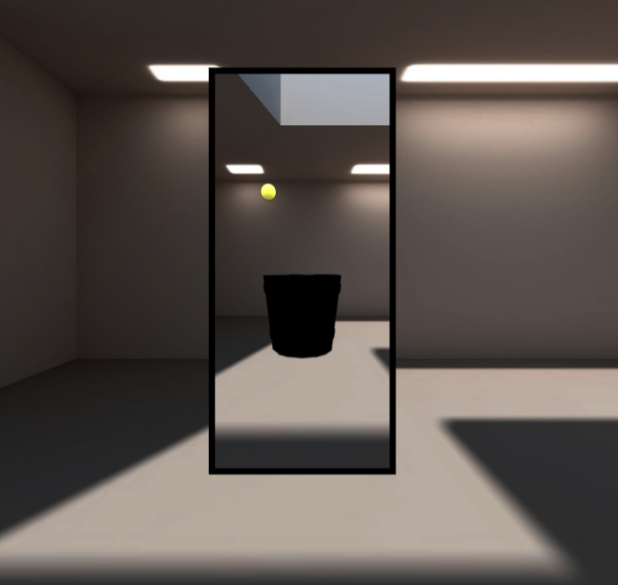

# About
[THREE.js](https://threejs.org/) project using [JavaScript modules](https://developer.mozilla.org/en-US/docs/Web/JavaScript/Guide/Modules) and [Parcel](https://parceljs.org/) from fdoganis template. 

It is a 3D game called "medieval bucketball" where the player has to launch a ball into a bucket, playing with AR

# Installation

`npm install`

install web xr for your browser to emulate a smartphone for test.

# Usage

`npm start`

This will build the app using parcel and launch the server

# Screen

